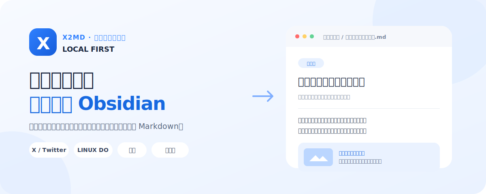
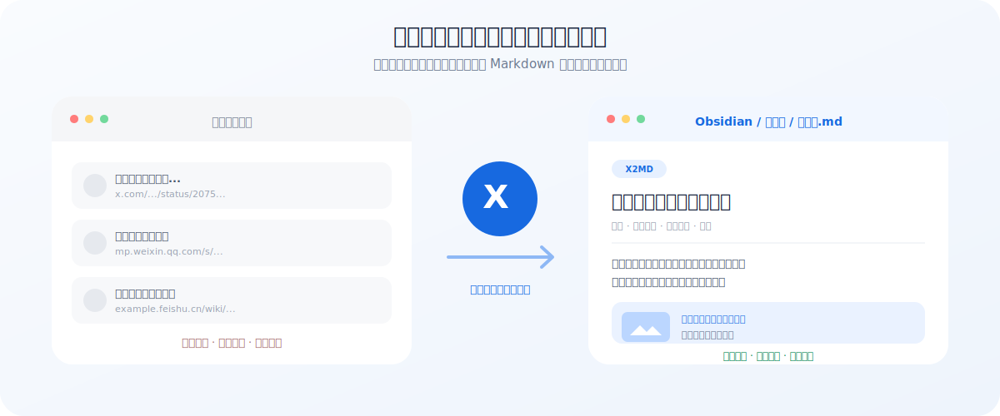
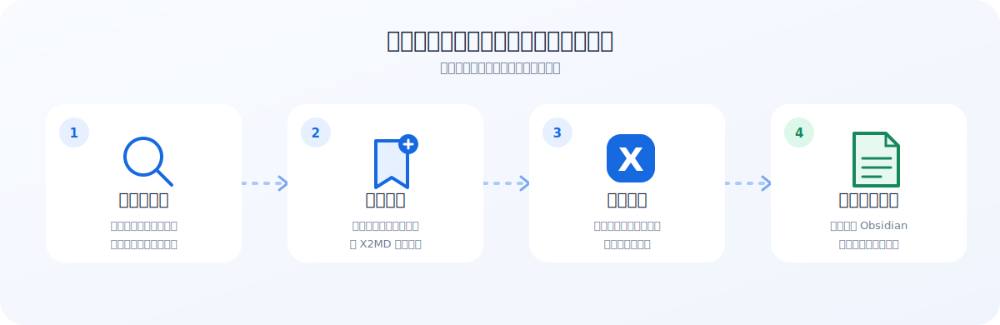

<div align="center">



# X2MD

**把网页好内容，变成真正属于你的本地笔记。**

X2MD 是一个本地优先的网页收藏工具。点击一次，就能把 X、LINUX DO、飞书和微信公众号内容，完整保存为可编辑、可搜索的 Markdown，并直接放进 Obsidian 或你的本地资料库。

[](https://github.com/izscc/x2md/releases/latest)
[](https://github.com/izscc/x2md/actions/workflows/build.yml)
[](https://github.com/izscc/x2md/stargazers)

[下载 Mac App](https://github.com/izscc/x2md/releases/latest/download/X2MD_Mac.zip) · [下载 Chrome 扩展](https://github.com/izscc/x2md/releases/latest/download/X2MD_Extension.zip) · [查看最新版本](https://github.com/izscc/x2md/releases/latest)

</div>

> [!NOTE]
> Mac 是当前 Stable 平台。Windows 版本仍处于 Beta，功能范围请查看[平台支持说明](docs/platform-support.md)。

## 为什么需要 X2MD？

浏览器收藏夹保存的是**链接**，X2MD 保存的是**内容**。

- 不必担心原网页删除后什么都没留下。
- 不必重新复制正文、图片、作者和原文地址。
- 保存后的笔记可以搜索、编辑、标注和继续创作。
- 文件就在你的电脑里，不被某个在线收藏服务锁住。



## 它是怎么工作的？



整个过程都在本地完成：浏览器扩展负责读取当前网页，X2MD App 负责整理内容并写入你选择的文件夹。

## 可以保存哪些内容？

| 来源 | 你可以保存什么 | 在哪里点击 |
| --- | --- | --- |
| **X / Twitter** | 普通推文、Thread、Note / Article、引用、图片和视频 | 推文的书签按钮 |
| **LINUX DO** | 话题帖子与正文内容 | 点赞按钮或 X2MD 悬浮按钮 |
| **飞书** | Wiki 知识库与 Docx 云文档 | 页面右上角的 X2MD 按钮 |
| **微信公众号** | 公众号文章、图片、代码块和引用 | 页面右上角的 X2MD 按钮 |

## 3 步开始使用

### 1. 下载并打开 X2MD App

下载 [`X2MD_Mac.zip`](https://github.com/izscc/x2md/releases/latest/download/X2MD_Mac.zip)，解压后运行 `X2MD.app`。

第一次启动时，App 会带你完成环境检查和保存目录设置。你只需要选择一个文件夹，例如 Obsidian 中的“素材库”。

### 2. 安装 Chrome 扩展

1. 下载并解压 [`X2MD_Extension.zip`](https://github.com/izscc/x2md/releases/latest/download/X2MD_Extension.zip)。
2. 在 Chrome 地址栏打开 `chrome://extensions/`。
3. 打开右上角的“开发者模式”。
4. 点击“加载已解压的扩展程序”，选择 `X2MD_Extension` 文件夹。
5. 在扩展连接页输入 App 中显示的 6 位配对码。

### 3. 保存第一篇内容

打开一条 X 推文，点击推文操作区的**书签按钮**。看到“保存成功”后，Markdown 文件就会出现在你设置的目录中。

在 LINUX DO、飞书和微信公众号中，则点击页面右上角的 X2MD 悬浮按钮。

## 保存后的笔记是什么样？

X2MD 会尽量保留内容原本的结构，而不是只生成一段纯文本。

```md
---
title: 如何把网页灵感变成长期资产
author: 示例作者
source: https://x.com/example/status/123456
saved_at: 2026-07-12
---

这里是完整、可编辑的正文内容。

原文中的 [链接](https://example.com)、@用户名、图片和视频引用也会一起保留。


```

你可以继续在 Obsidian 中加标签、建立双向链接、摘录重点，或把它作为写作素材。

## X2MD V4 带来了什么？

### 内容真正保存在本地

Markdown、图片和可选的视频文件都由你管理。保存位置可以是普通文件夹，也可以直接是 Obsidian Vault。

### 链接、图片和长文尽量完整

V4 会处理 X 的普通推文、Thread、Note / Article、引用内容、完整链接、`@用户名` 主页链接和媒体内容。

### 重复保存不会弄乱资料库

默认会跳过已经保存的内容。你也可以在 App 中改为“更新已有笔记”或“每次另存一份”。

### 批量任务可以随时继续

批量保存书签或博主内容时，可以暂停、继续、取消和重试失败项。即使页面关闭，任务状态仍由 App 保留。

### 设置集中在一个地方

保存目录、文件名、图片、视频、重复策略、整理规则和任务历史都在桌面 App 中统一管理。

## 常见问题

<details>
<summary><strong>扩展提示“服务未启动”或“需要配对”</strong></summary>

确认 X2MD App 正在运行。如果 App 已运行但扩展仍无法连接，请在 App 中获取新的 6 位配对码并重新配对。

</details>

<details>
<summary><strong>显示保存成功，但找不到 Markdown 文件</strong></summary>

在 X2MD App 中检查当前保存目录。你也可以从保存历史或任务结果中直接打开对应目录。

</details>

<details>
<summary><strong>再次保存同一篇内容会怎样？</strong></summary>

默认策略是跳过重复内容，并返回已有文件。你可以在 App 中切换为更新已有文件或每次生成新文件。

</details>

<details>
<summary><strong>批量保存关闭页面后会中断吗？</strong></summary>

不会。任务由桌面 App 持久保存，可以在任务中心暂停、继续、取消或只重试失败项目。

</details>

<details>
<summary><strong>Windows 可以使用吗？</strong></summary>

可以下载 [`X2MD_Windows_Beta.zip`](https://github.com/izscc/x2md/releases/latest/download/X2MD_Windows_Beta.zip)，但它仍是 Beta，暂不包含 Mac 版的完整托盘、设置窗口和开机启动体验。请先阅读[平台支持说明](docs/platform-support.md)。

</details>

## 更多说明

- [V4 迁移说明](docs/migrations/x2md-v4.md)：从旧版本升级前建议阅读。
- [平台支持说明](docs/platform-support.md)：Mac Stable 与 Windows Beta 的能力边界。
- [构建与打包](BUILD.md)：开发环境、测试和发布产物说明。
- [V4 产品设计](docs/prd/x2md-v4-reliable-knowledge-inbox-prd.md)：完整产品目标和技术决策。
- [V4 Release Notes](release/v4.0.0/RELEASE_NOTES.md)：本次版本新增与修复内容。

## 给开发者

X2MD V4 使用 Electrobun + Bun / TypeScript 构建 Mac App，Chrome 扩展采用 Manifest V3。

```bash
# 安装依赖并启动开发版
bun install
bun run dev

# 运行类型检查与全部测试
npm run check

# 构建 Mac App
bun run build:mac
```

核心目录：

```text
app/
├── core/          # 保存、Markdown、媒体、配置与任务核心
├── main/          # 桌面 App 与本地 API 入口
└── ui/settings/   # 设置与任务中心界面

extension/         # Chrome 扩展与各网站采集逻辑
docs/              # 使用说明、设计和验收文档
scripts/           # 构建、发布与冒烟测试
```

完整开发和发布命令请查看 [`BUILD.md`](BUILD.md)。Python 桌面端仅作为冻结兼容实现保留，不再进入 Stable Release。

## 安全与隐私

- X2MD 只监听本机地址 `127.0.0.1:9527`。
- 扩展需要通过一次性配对码连接 App。
- 保存目录、配置和任务状态均由本机 App 管理。
- 项目不会要求你把 Obsidian 笔记上传到第三方服务器。

---

<div align="center">

如果 X2MD 帮你留下了有价值的内容，欢迎点一个 ⭐。

[下载最新版](https://github.com/izscc/x2md/releases/latest) · [报告问题](https://github.com/izscc/x2md/issues) · [查看更新日志](release/v4.0.0/RELEASE_NOTES.md)

</div>
