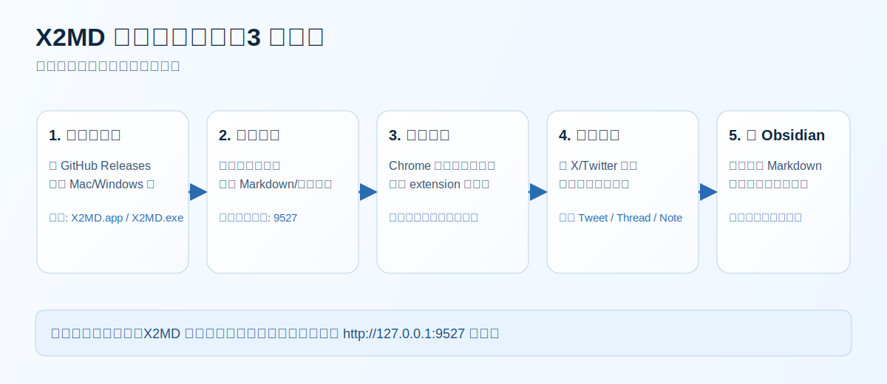
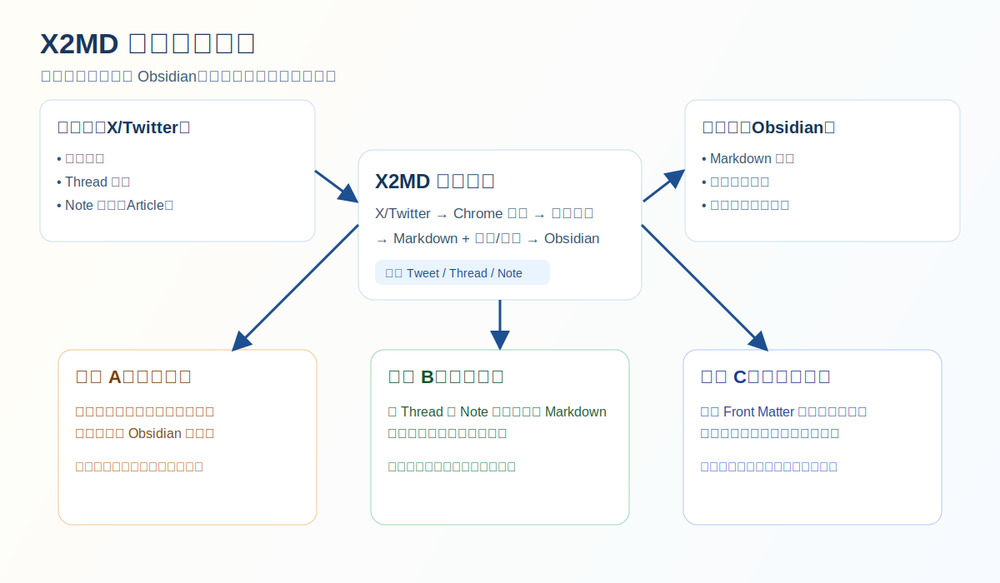

# X2MD

把 X/Twitter 内容一键保存为 Obsidian 可用的 Markdown（支持 Tweet、Thread、Note/Article、图片和视频）。

[](https://github.com/izscc/x2md)
[](https://github.com/izscc/x2md/releases/latest)
[](https://github.com/izscc/x2md/actions/workflows/build.yml)

## 教程导览图



## 适用场景

- 你会在 X/Twitter 上收藏大量信息，但链接回看效率低。
- 你希望把素材沉淀进 Obsidian，而不是散落在浏览器书签里。
- 你需要把 Thread / Note 长文转成可编辑 Markdown，用于二次创作。

## 3 分钟快速上手（推荐）

### 第 1 步：下载客户端（基于 GitHub Release）

- 打开 [Releases](https://github.com/izscc/x2md/releases/latest)
- 当前最新版本（截至 2026-03-22）：[`v1.0.4`](https://github.com/izscc/x2md/releases/tag/v1.0.4)
- 下载对应平台包：
  - Mac: [`X2MD_Mac.zip`](https://github.com/izscc/x2md/releases/download/v1.0.4/X2MD_Mac.zip)
  - Windows: [`X2MD_Windows.zip`](https://github.com/izscc/x2md/releases/download/v1.0.4/X2MD_Windows.zip)

### 第 2 步：首次运行并完成向导

1. 解压并运行 `X2MD.app`（Mac）或 `X2MD.exe`（Windows）。
2. 按向导设置：
   - Markdown 保存目录
   - 视频保存目录
3. 向导完成后，服务会在本地启动（默认 `127.0.0.1:9527`）。

### 第 3 步：安装 Chrome 扩展

1. 打开 `chrome://extensions/`
2. 开启“开发者模式”
3. 点击“加载已解压的扩展程序”
4. 选择本项目的 [`extension`](./extension) 目录

### 第 4 步：保存第一条推文

1. 打开任意 X/Twitter 推文页。
2. 点击推文操作区的书签按钮。
3. 扩展会将内容发送到本地服务并生成 Markdown。
4. 到你设置的目录查看 `.md` 文件。

### 第 5 步：在 Obsidian 中查看结果

- 生成内容默认包含 Front Matter。
- 图片会写入原图链接（`name=orig`）。
- 视频可配置为下载并写入 Obsidian 嵌入引用。

## 常用配置（进阶）

配置文件为根目录的 `config.json`，常用字段：

- `save_paths`: Markdown 输出目录列表
- `filename_format`: 文件名模板，支持 `{summary}` `{date}` `{author}`
- `max_filename_length`: 文件名长度上限
- `video_save_path`: 视频保存路径
- `enable_video_download`: 是否下载视频
- `video_duration_threshold`: 超长视频二次确认阈值（分钟）

推荐模板示例：

```json
{
  "filename_format": "{summary}_{date}_{author}",
  "max_filename_length": 60,
  "enable_video_download": true,
  "video_duration_threshold": 5
}
```

## 使用场景示意



### 场景 A：资料收藏

把高价值推文直接沉淀到素材库，避免后续失链或遗忘。

### 场景 B：内容创作

把 Thread / Note 转成 Markdown 后可快速摘录、改写、重组。

### 场景 C：知识库建设

统一命名与元数据，长期形成可检索、可关联的个人知识资产。

## 常见问题

### 1) 扩展提示“服务未启动”

- 确认桌面程序正在运行。
- 检查扩展端口与 `config.json` 中 `port` 一致。
- 访问 `http://127.0.0.1:9527/ping`，应返回 `{"status":"ok"...}`。

### 2) 保存成功但没有文件

- 检查 `save_paths` 是否存在写权限。
- 查看日志 `x2md.log`。

### 3) 视频没有下载

- 检查 `enable_video_download` 是否为 `true`。
- 视频超过阈值时会触发二次确认。
- 检查 `video_save_path` 是否可写。

## 本地开发与打包

安装依赖：

```bash
pip3 install -r requirements.txt
```

开发运行：

```bash
# 向导 + 托盘 + 服务
python3 tray_app.py

# 仅服务
python3 server.py
```

打包说明见 [`BUILD.md`](./BUILD.md)。
CI 工作流见 [`.github/workflows/build.yml`](./.github/workflows/build.yml)。

## 项目结构

```text
.
├── server.py               # 本地 HTTP 服务（/ping /config /save）
├── tray_app.py             # 桌面托盘入口
├── setup_wizard.py         # 首次配置向导
├── extension/              # Chrome 扩展（MV3）
├── BUILD.md                # 打包说明
└── docs/images/            # README 配图
```

## GitHub 数据来源

- 仓库信息: <https://api.github.com/repos/izscc/x2md>
- 语言统计: <https://api.github.com/repos/izscc/x2md/languages>
- 最新发布: <https://api.github.com/repos/izscc/x2md/releases/latest>
